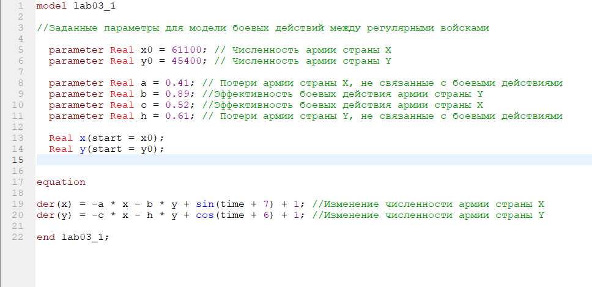
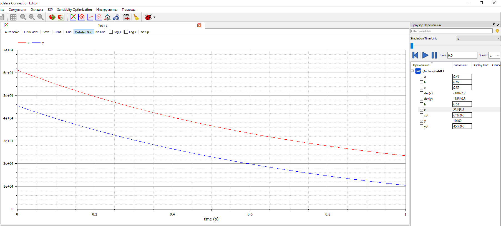
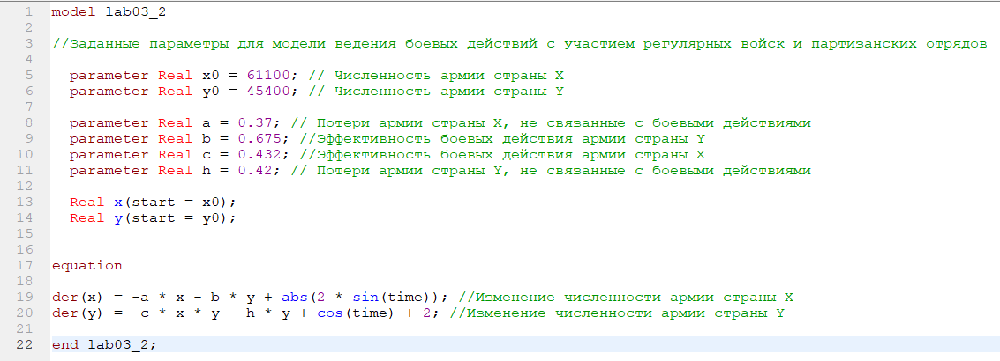
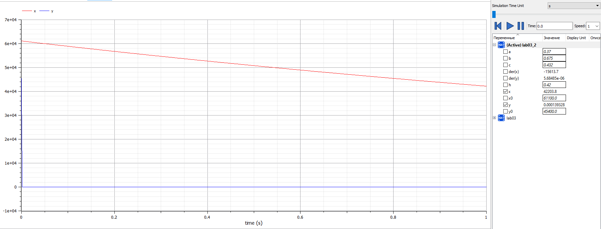

---
# Front matter
lang: ru-RU
title: "Лабораторная работа №3. Вариант 50."
subtitle: "Модель боевых действий. Модели Ланчестера"
author: "Силкина Мария Александровна"

# Formatting
toc-title: "Содержание"
toc: true # Table of contents
toc_depth: 2
lof: true # List of figures
lot: true # List of tables
fontsize: 12pt
linestretch: 1.5
papersize: a4paper
documentclass: scrreprt
polyglossia-lang: russian
polyglossia-otherlangs: english
mainfont: Arial
romanfont: Arial
sansfont: Arial
monofont: Arial
mainfontoptions: Ligatures=TeX
romanfontoptions: Ligatures=TeX
sansfontoptions: Ligatures=TeX,Scale=MatchLowercase
monofontoptions: Scale=MatchLowercase
indent: true
pdf-engine: lualatex
header-includes:
  - \linepenalty=10 # the penalty added to the badness of each line within a paragraph (no associated penalty node) Increasing the value makes tex try to have fewer lines in the paragraph.
  - \interlinepenalty=0 # value of the penalty (node) added after each line of a paragraph.
  - \hyphenpenalty=50 # the penalty for line breaking at an automatically inserted hyphen
  - \exhyphenpenalty=50 # the penalty for line breaking at an explicit hyphen
  - \binoppenalty=700 # the penalty for breaking a line at a binary operator
  - \relpenalty=500 # the penalty for breaking a line at a relation
  - \clubpenalty=150 # extra penalty for breaking after first line of a paragraph
  - \widowpenalty=150 # extra penalty for breaking before last line of a paragraph
  - \displaywidowpenalty=50 # extra penalty for breaking before last line before a display math
  - \brokenpenalty=100 # extra penalty for page breaking after a hyphenated line
  - \predisplaypenalty=10000 # penalty for breaking before a display
  - \postdisplaypenalty=0 # penalty for breaking after a display
  - \floatingpenalty = 20000 # penalty for splitting an insertion (can only be split footnote in standard LaTeX)
  - \raggedbottom # or \flushbottom
  - \usepackage{float} # keep figures where there are in the text
  - \floatplacement{figure}{H} # keep figures where there are in the text
---

# Цель работы

Построение математической модели боевых действий - модели Ланчестера.

# Задание

1. Построить график изменения численности войск армии Х и армии У при боевых действиях между регулярными войсками.
2. Построить график изменения численности войск армии Х и армии У при боевых действиях с участием регулярных войск и партизанских отрядов.

# Выполнение лабораторной работы

Лабораторная работа выполнялась мной на языке Modelica. Мне были известны начальные данные(параметры) задачи для первого случая: 

1. Начальная численность войска армии страны X x0 = 61100 человек.
2. Начальная численность войска армии страны Y y0 = 45400 человек.
3. Коэффициент потери армии страны Х, не связанные с боевыми действиями a = 0.41.
4. Коэффициент потери армии страны Y, не связанные с боевыми действиями h = 0.61.
5. Эффективность боевых действия армии страны Y b = 0.89.
6. Эффективность боевых действия армии страны Y c = 0.52.
7. Функции подкрепления к войскам X P(t) = sin(t + 7) + 1.
8. Функции подкрепления к войскам Y Q(t) = cos(t + 6) + 1.
  
В первом случае я рассмотрела модель боевых действий для двух регулярных армий:
$$\frac{dx}{dt}=-0,41x(t)-0,89y(t)+sin(t + 7)+1 $$
$$\frac{dy}{dt}=-0,52x(t)-0,61y(t)+cos(t + 6)+1 $$
Код программы представлен на рис.1.  (рис 1. -@fig:001)  

{ #fig:001 width=70% }  

При запуске программы был выведен график. (рис 2. -@fig:001)  

{ #fig:001 width=70% }    

Мне были известны начальные данные(параметры) задачи для второго случая: 

1. Начальная численность войска армии страны X x0 = 61100 человек.
2. Начальная численность войска армии страны Y y0 = 45400 человек.
3. Коэффициент потери армии страны Х, не связанные с боевыми действиями a = 0.37.
4. Коэффициент потери армии страны Y, не связанные с боевыми действиями h = 0.42.
5. Эффективность боевых действия армии страны Y b = 0.675.
6. Эффективность боевых действия армии страны Y c = 0.432.
7. Функции подкрепления к войскам X P(t) = |2sin(t)|.
8. Функции подкрепления к войскам Y Q(t) = cos(t ) + 2.

Во втором случае я рассмотрела модель ведения боевых действий с участием регулярной и партизанской армий:
$$\frac{dx}{dt}=-0,37x(t)-0,675y(t)+|2sin(t)| $$
$$\frac{dy}{dt}=-0,432x(t)y(t)-0,42y(t)+cos(t ) + 2 $$
Код программы для второго случая на рис.3  (рис 3. -@fig:001) 

{ #fig:001 width=70% }  

При помощи данной программы был выведен график. Он продемонстрирован на рис.4 (рис 4. -@fig:001)  

{ #fig:001 width=70% }  

# Выводы

При выполнении данной лабораторной работы я научилась строить модель боевых действий. Я узнала про модель Ланчестера и как она применима.
